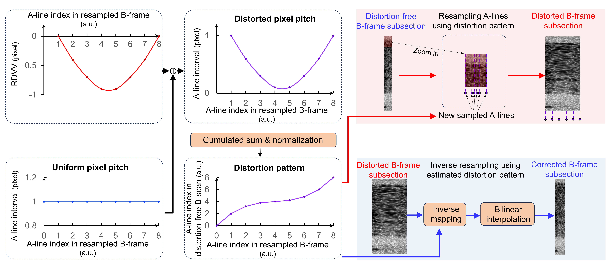

# Table of Contents

- [General info](#General-info)
- [Methods pipeline](Methods-pipeline)
- [Contents](#Contents)
- [Getting started](#Getting-started)

# General info

This Git repository contains python codes for implementing the NRNet model proposed here. The NRNet is a deep-learning approach which integrates the rotation dynamics model of the rotatable diametrically magnetized cylinder permanent magnet (RDPM) and is trained using synthetic data.

The mainly capability of the code is to accurately correct the rotational distortions in Optical Coherence Tomography (OCT) images which were sampled in the rat esophagus and the mouse colon. The current version includes the following models:

1. **Struct Detection Network** (SDNet)

2. **Nonuniform Rotational Distortion Detection Network** (NDNet)

3. **Nonuniform Rotational Distortion Correction Network** (NCNet)

# Methods pipeline

The methods for generating the dataset for the NRNet model, the specific working principles and the evaluation of the model's image restoration capabilities can all be found in the paper. The dataset generation method and the working principles of the NRNet model are illustrated in the diagram below.



# Contents

# Getting started

## Setup
Python dependencies:

- pytorch
- opencv
- sklearn
- skimage

We provide a `requirements.txt` including all of the above dependencies. To create a new conda environment and install the dependencies, run:

    ```bash
    conda create --name nrnet python=3.9
    conda activate nrnet
    pip install -r requirements.txt
    ```
## Initialization

Obtain the correction net checkpoint from [Google Drive](https://drive.google.com/file/d/1MupEM5652VPwYeARrCFa971LdnXfhOCX), and create a new directory named `weights` and place the checkpoint within.

## Data Preparation

You can use our provided data to test the model.

## Initiation

Run

    ```bash
    python oct_restore.py
    ```

to start inference. The results will be saved in the `./outputs`.
