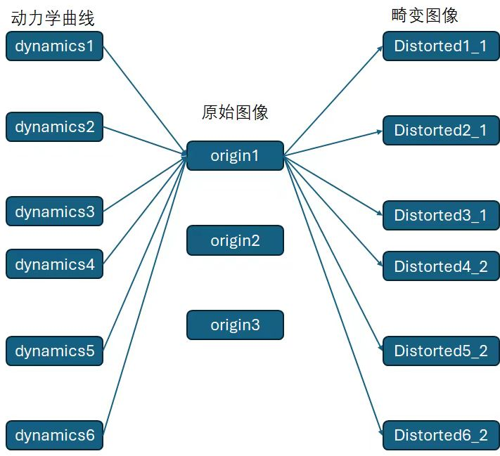

# OCT Dataset

## Download the dataset

Dataset can be downloaded from [Google Drive](https://drive.google.com/drive/folders/1H5xdALyERpqmABYI6VVqiCFCwWWD_ndI?usp=share_link). You need to rename the folder to `images`(by default) and place it in the root directory.

## Environment setup

You may want to create a new conda environment and install the required packages using the following commands:

```bash
conda create -n oct python=3.9
conda activate oct
pip install -r requirements.txt
```

## Run

To create the dynamics curves, run the following command:

```bash
conda activate oct
python create_random.py --num_datasets 100
# or
python random_v2.py --num_datasets 100
```

To create distorted images, run the following command:

```bash
python create_distorted.py --num_samples 100
```

It is important that that the number of dynamics curves should be greater than the number of desired images dived by images in `images` folder. Here is a statement of our workflow:



## Label Format

[YOLOv5 PyTorch TXT](https://roboflow.com/formats/yolov5-pytorch-txt?ref=ultralytics#w-tabs-0-data-w-pane-3)

> [!NOTE]
> x, y, w, h should be normalized in label, which was fixed in commit [`3362310`](https://github.com/kowyo/oct-dataset/commit/33623103c2806f16a52a855c5ce60e5f6c20f85e)

## YOLO Training Results

The custom weight `best.pt` is stored in `yolo/train/weights`

It was trained using [YOLOv8](https://github.com/ultralytics/ultralytics), with 5000 images and 101 epoch. You can use the weight to predict ditorted region by following the instruction on [ultralytics's document](https://docs.ultralytics.com/modes/predict/).

You can also use `detect.py` in `yolo` to make prediction.
